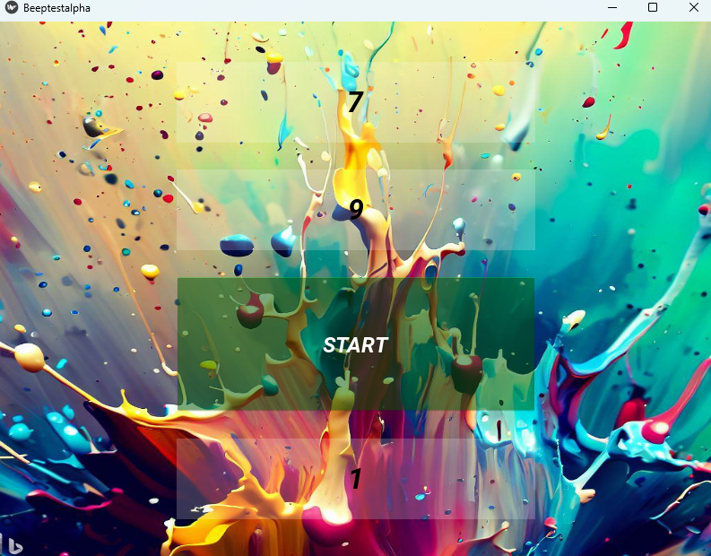
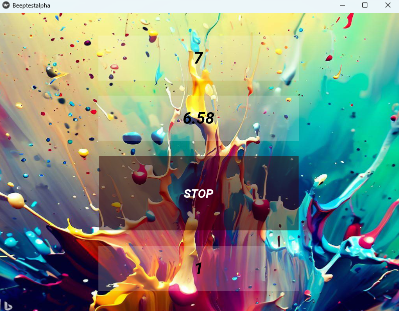

# Beeptestapplication

This is a simple application designed to help you complete [Multi-stage fitness test](https://en.wikipedia.org/wiki/Multi-stage_fitness_test)

---
# Table of contents
1. [How it works](#how-it-works)
2. [Libraries Used](#libraries-used)
3. [Getting Started](#getting-started)
4. [TODO](#todo)
---
## How it works
After forking this repository the only thing you have to do to start is exec the Beeptestalpha Python file.

---

## Libraries Used
- Kivy

---
## Getting Started
Just press the START button to begin running.
The top label indicates the remaining time for each lap.
The middle label shows the number of laps remaining at the current level.
The bottom label indicates the current level you are on.

---
## TODO
* add best result memory
* add distance covered
* add time during training
* launch mobile version

---
